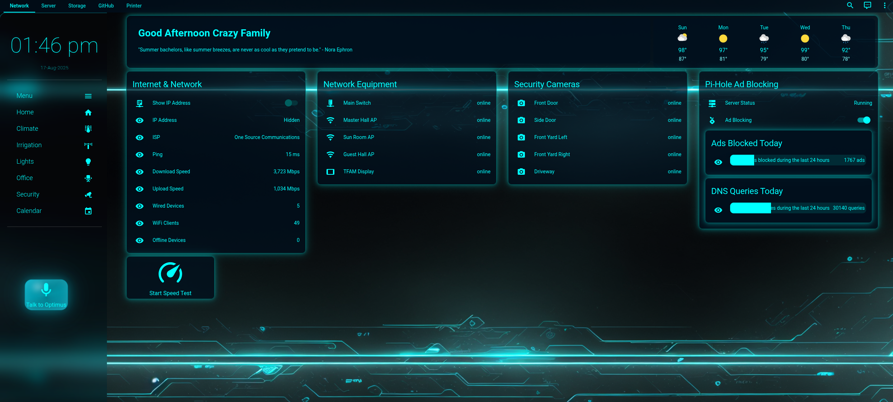
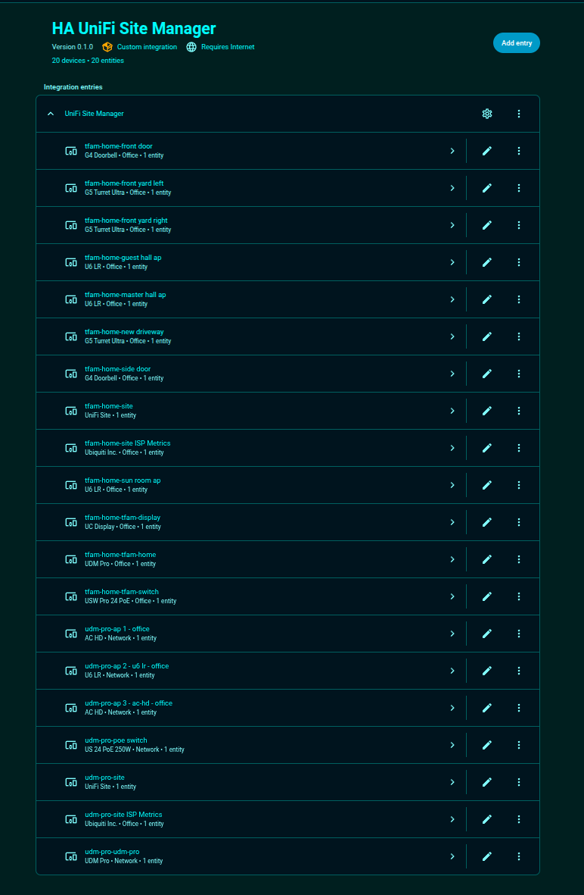
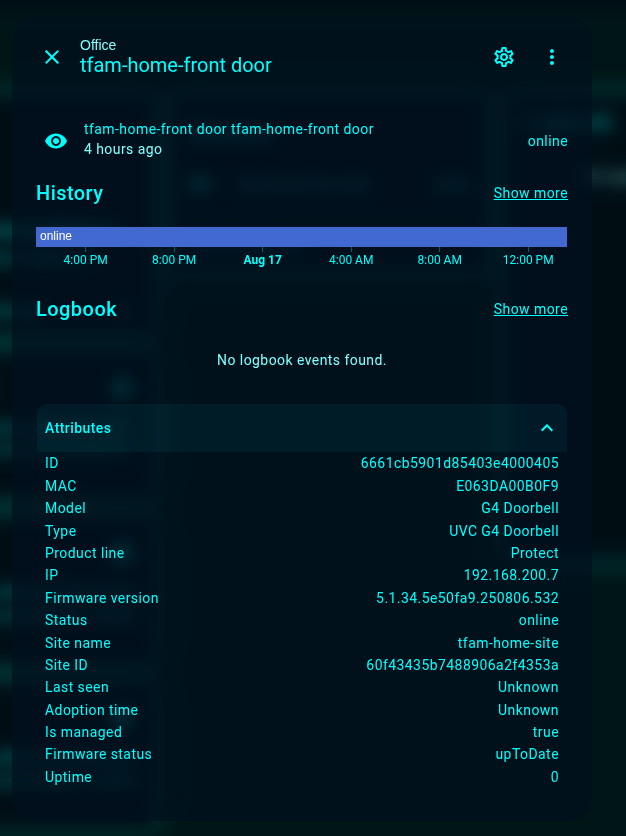

# 🌐 UniFi Site Manager for Home Assistant

## 🔍 About

A powerful Home Assistant integration that provides comprehensive monitoring and management capabilities for UniFi network devices across multiple sites through the UI.com API.

[](https://github.com/custom-components/hacs)
[![GitHub Release][releases-shield]][releases]
![Project Maintenance][maintenance-shield]

---
## 💸 Donations Appreciated!
If you find this plugin useful, please consider donating. Your support is greatly appreciated!

### Sponsor me on GitHub
[](https://github.com/sponsors/biofects?frequency=recurring&sponsor=biofects) 

### or
## Paypal

[](https://www.paypal.com/cgi-bin/webscr?cmd=_s-xclick&hosted_button_id=TWRQVYJWC77E6)
---

## ✨ Features

- 🌐 **Multi-Site Support**: Monitor and manage multiple UniFi sites from a single dashboard
- 📊 **ISP Metrics**: Track network performance metrics including:
  - Latency (average, minimum, maximum)
  - Packet Loss (percentage and count)
  - Bandwidth (download and upload speeds)
  - WAN Status (uptime, downtime)
  - ISP Information (name, ASN)
- 🔌 **Device Management**: 
  - Real-time device status monitoring
  - Detailed device information (model, version, IP)
  - Online/Offline state tracking
- 📈 **Site Statistics**:
  - Total and offline device counts
  - Client statistics (WiFi, wired, guest)
  - WAN uptime percentage
  - ISP information
- 🔄 **SD-WAN Configuration Monitoring**:
  - Monitor SD-WAN configuration status
  - View configuration details and settings
  - Track configuration updates and changes
  - Support for multiple SD-WAN configs per site

## 📸 Screenshots

| Example Dashboard | Devices View | Device Example |
|------------------|--------------|----------------|
|  |  |  |


## 🚀 Installation

### HACS Installation (Recommended)

1. Open HACS in your Home Assistant instance
2. Click on "Integrations"
3. Click the three dots in the top right corner
4. Select "Custom repositories"
5. Add this repository URL
6. Select "Integration" as the category
7. Click "Add"
8. Find "UniFi Site Manager" in the integration list
9. Click "Download"
10. Restart Home Assistant

### Manual Installation

1. Download the latest release
2. Copy the `custom_components/ha_unifi_site_manager` directory to your Home Assistant's `custom_components` directory
3. Restart Home Assistant

## ⚙️ Configuration

1. Go to Settings > Devices & Services
2. Click "Add Integration"
3. Search for "UniFi Site Manager"
4. Enter your UI.com API key
   - Get your API key from [https://account.ui.com/api-keys](https://account.ui.com/api-keys)

## 📡 Sensors

### Site Sensor
- **State**: Online/Offline (based on device status)
- **Attributes**:
  - Site ID and Host ID
  - Description and Gateway MAC
  - Timezone
  - Device counts (total, offline)
  - Client counts (WiFi, wired, guest)
  - WAN uptime percentage
  - ISP information

### Device Sensor
- **State**: Online/Offline
- **Attributes**:
  - Device ID and MAC address
  - Model and version
  - IP address
  - Last seen timestamp
  - Uptime

### ISP Metrics Sensor
- **State**: Current timestamp
- **Attributes**:
  - Latency metrics (avg, min, max)
  - Packet loss (percentage, count)
  - Bandwidth (download/upload Mbps)
  - WAN metrics:
    - Latency (avg, max)
    - Bandwidth (download/upload kbps)
    - Packet loss
    - Uptime/downtime
    - ISP details (name, ASN)

### SD-WAN Configuration Sensor
- **State**: Configuration status (active, inactive, etc.)
- **Attributes**:
  - Configuration ID and name
  - Description and type
  - Creation and last updated timestamps
  - Detailed configuration settings

## 📈 Changelog

### Version 0.2.0
- ✨ **NEW**: Added SD-WAN configuration monitoring support
- ✨ **NEW**: Support for List SD-WAN Configs endpoint
- ✨ **NEW**: Support for Get SD-WAN Config by ID endpoint  
- ✨ **NEW**: Support for Get SD-WAN Config Status endpoint
- 🔧 **IMPROVED**: Enhanced error handling for missing SD-WAN configurations
- 🔧 **FIXED**: Resolved device registry warnings for via_device references
- 🔧 **OPTIMIZED**: Only creates SD-WAN sensors when configurations are available

### Version 0.1.0
- 🎉 Initial release
- ✨ Multi-site support
- ✨ ISP metrics monitoring
- ✨ Device status tracking
- ✨ Site statistics

## ⏱️ Update Interval

The integration updates every 15 minutes by default. This interval is configurable through the `const.py` file if needed.

## 🔒 API Authentication

The integration uses API key authentication with the UI.com API. The API key is stored securely in Home Assistant's encrypted storage and is never exposed in plain text.

## ⚠️ Error Handling

The integration includes comprehensive error handling for:
- API connection issues
- Authentication failures
- Missing or incomplete data
- Network timeouts

## 🔧 Debugging

To enable debug logging, add the following to your `configuration.yaml`:

```yaml
logger:
  default: info
  logs:
    custom_components.ha_unifi_site_manager: debug
```

## 🤝 Contributing

Feel free to contribute to this project. Please read the contributing guidelines before making a pull request.

## 📜 License

This project is licensed under the MIT License - see the LICENSE file for details.

## ⚖️ Disclaimer

This integration is not affiliated with Ubiquiti Inc. or UI.com. All product names, logos, and brands are property of their respective owners.

[releases-shield]: https://img.shields.io/github/release/tfam/ha_unifi_site_manager.svg
[releases]: https://github.com/tfam/ha_unifi_site_manager/releases
[maintenance-shield]: https://img.shields.io/maintenance/yes/2024.svg
